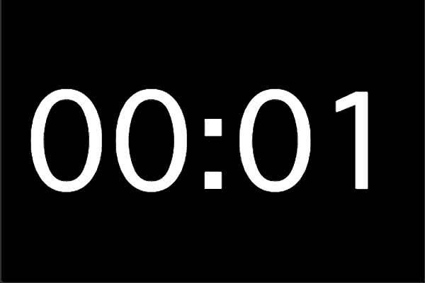

# Fullscreen Timer

This is a simple timer for presenter who wish to see how much time he / she has spend

Please try online version: https://alphakevin.github.io/fullscreen-timer/

## Keyboard Shortcut

* <kbd>F</kbd> - toggle fullscreen mode.
* <kbd>←</kbd> <kbd>→</kbd> <kbd>↑</kbd> <kbd>↓</kbd> - edit timer.
* <kbd>R</kbd> - reset timer
* <kbd>S</kbd> - mode: countdown or stopwatch
* <kbd>Space</kbd> - start / pause timer

## Licence

[MIT](./LICENSE)
